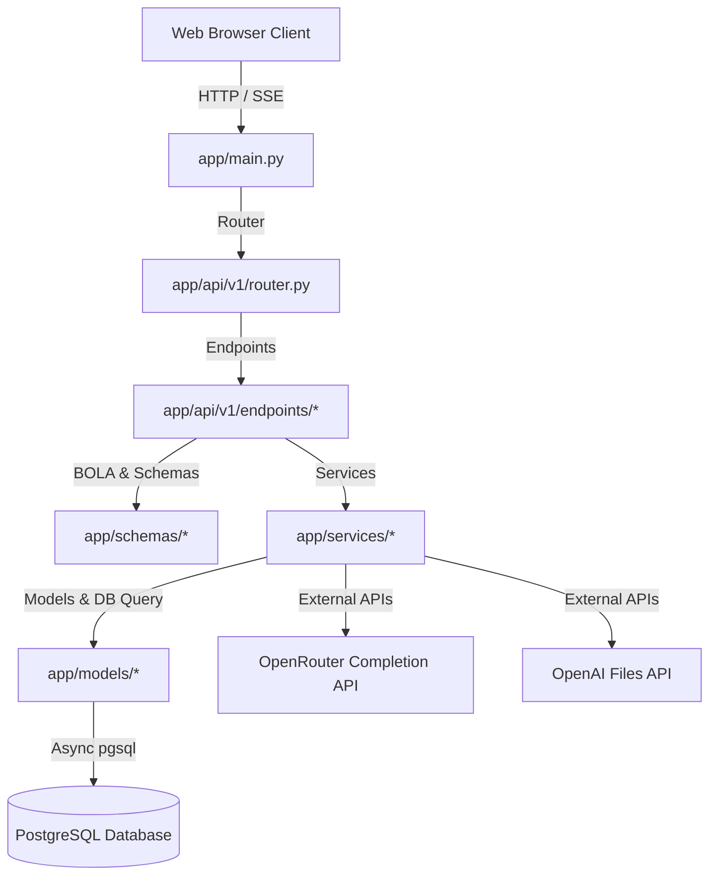

# Backend Architecture & Codebase Explanation

This document provides a comprehensive walkthrough of the backend codebase for the Chatbot Platform, a 100% asynchronous Python application built on **FastAPI**, **PostgreSQL** (via **SQLAlchemy 2.0** and **asyncpg**), and **Alembic**.

---

## 1. Architectural Overview

The backend is structured as a clean-architecture API layer designed for high concurrency, security, and developer clarity. It communicates with PostgreSQL asynchronously and interfaces with external LLM and file storage APIs.



### Core Technologies
*   **FastAPI**: Provides fast, type-safe ASGI routing with automatic OpenAPI schema generation.
*   **SQLAlchemy 2.0 (Async)**: Modern ORM using `Mapped` and `mapped_column` type annotations. All database interactions run asynchronously using the `asyncpg` driver.
*   **Alembic**: Database migrations manager tracking changes dynamically on Postgres.
*   **Bcrypt & Python-Jose**: Cryptographic hashing of passwords and generation/validation of JWT tokens.
*   **HTTPX**: Asynchronous HTTP client for sending SSE connections to OpenRouter and managing multipart file uploads to OpenAI.
*   **SlowAPI**: Rate limiting middleware to prevent brute-force attacks and resource abuse.

---

## 2. Directory Structure

Below is the layout of the `backend/` directory:

```text
backend/
├── alembic/                # Database migration scripts and environment config
├── app/
│   ├── api/                # API controllers and routers
│   │   └── v1/
│   │       ├── endpoints/  # Resource endpoints (auth, projects, chat, files, users)
│   │       └── router.py   # Aggregates endpoints
│   ├── core/               # Global configs, dependencies, and security
│   │   ├── config.py       # Pydantic Settings management
│   │   ├── dependencies.py # Database sessions and auth injections
│   │   └── security.py     # JWT hashing and signature utilities
│   ├── db/                 # DB initialization and base models
│   │   ├── base.py         # Declarative base class
│   │   └── session.py      # Async connection engine and session factory
│   ├── middleware/         # App-level interceptors
│   │   ├── error_handler.py# Exception mapping to custom JSON envelopes
│   │   └── rate_limiter.py # Request throttling constraints
│   ├── models/             # SQLAlchemy ORM models
│   ├── schemas/            # Pydantic schema serialization models
│   ├── services/           # Service-level business logic
│   └── main.py             # App bootloader and middleware registration
├── requirements.txt        # Backend python dependencies
├── Dockerfile              # Docker container settings
├── pyproject.toml          # Ruff linter config
└── docker-compose.yml      # Root multi-container composer
```

---

## 3. Detailed Modules Walkthrough

### 3.1. App Core & Configuration
*   **[app/core/config.py](file:///Users/newuser/Documents/2026-projects/chatbot-platform/backend/app/core/config.py)**:
    Defines the global `Settings` class inheriting from Pydantic's `BaseSettings`. It loads variables directly from `/backend/.env` (e.g. database credentials, JWT secrets, and external API keys) with strict type validation.
*   **[app/core/security.py](file:///Users/newuser/Documents/2026-projects/chatbot-platform/backend/app/core/security.py)**:
    Handles security actions. Features native `bcrypt` functions to hash and verify passwords (replacing `passlib` to bypass Python 3.11 compatibility crashes). Provides utility functions to encode and decode access and refresh JWTs.
*   **[app/core/dependencies.py](file:///Users/newuser/Documents/2026-projects/chatbot-platform/backend/app/core/dependencies.py)**:
    Exposes dependency-injection providers for routes:
    *   `get_db`: Yields an active asynchronous database session transaction and ensures closure.
    *   `get_current_user`: Intercepts Request Headers, decodes the JWT access token, and resolves the user entity, raising `401 Unauthorized` on expired or invalid credentials.

### 3.2. Database Configuration & Models
*   **[app/db/session.py](file:///Users/newuser/Documents/2026-projects/chatbot-platform/backend/app/db/session.py)**:
    Creates the async database engine using `create_async_engine` (configured with `future=True`) and instantiates `AsyncSessionLocal`, an `async_sessionmaker` factory used to create transient database sessions.
*   **[app/db/base.py](file:///Users/newuser/Documents/2026-projects/chatbot-platform/backend/app/db/base.py)**:
    Defines the declarative metadata parent class `Base(DeclarativeBase)` used by all database entities.
*   **[app/models/](file:///Users/newuser/Documents/2026-projects/chatbot-platform/backend/app/models/)**:
    ORM entities defining DB tables and relationships:
    *   `User`: Represents platform accounts. Normalizes user emails to lowercase. Has dynamic relations to `Project` and `RefreshToken`.
    *   `Project`: Workspaces owning custom system prompts, associated chat logs, and vector files. Has relationships to `Message` and `ProjectFile`.
    *   `Message`: Stores conversation items with roles (`user`, `assistant`, `system`).
    *   `ProjectFile`: Stores reference data of uploaded documents mapped to `openai_file_id`.
    *   `RefreshToken`: Persists hashes of active rotated tokens mapping to user ID.
    *   `__init__.py`: Imports all models at boot time to register them in SQLAlchemy's registry globally, preventing mapper compiler errors (e.g., *'Project' failed to locate a name*).

### 3.3. Pydantic Serialization Schemas
*   **[app/schemas/](file:///Users/newuser/Documents/2026-projects/chatbot-platform/backend/app/schemas/)**:
    Maintains clean separation of database state and JSON schemas:
    *   `common.py`: Establishes the standard API response envelopes:
        *   `SuccessResponse[T]`: Encapsulated as `{ success: true, data: T }`
        *   `ErrorResponse`: Encapsulated as `{ success: false, error: "CODE", message: "detail message" }`
    *   `auth.py`: Controls login credentials inputs and token models.
    *   `user.py`: Standardizes registration body validations (enforcing password lengths/contents).
    *   `project.py`: Handles workspace configuration updates.
    *   `message.py`: Structures prompt items and logs lists.
    *   `file.py`: Describes metadata returned from file uploader services.

### 3.4. Service Layers (Business Logic)
*   **[app/services/auth_service.py](file:///Users/newuser/Documents/2026-projects/chatbot-platform/backend/app/services/auth_service.py)**:
    Orchestrates authentication flow. On login/registration, it issues an access token and generates a cryptographically secure refresh token. The refresh token's SHA-256 hash is persisted in the database. When refreshing, it rotates the refresh token (deletes the old hash and issues a brand-new token pair), mitigating token replay attacks.
*   **[app/services/project_service.py](file:///Users/newuser/Documents/2026-projects/chatbot-platform/backend/app/services/project_service.py)**:
    Provides CRUD utilities for projects. Includes strict checks verifying that the requesting user owns the target project resources.
*   **[app/services/chat_service.py](file:///Users/newuser/Documents/2026-projects/chatbot-platform/backend/app/services/chat_service.py)**:
    Streams chatbot tokens using an HTTPX async stream request to the OpenRouter Completions API.
    *   Formats the request with system prompts and previous message history.
    *   Reads and yields lines asynchronously (`response.aiter_lines()`), parsing server-sent event tokens.
    *   Safely intercepts `GeneratorExit` (early client disconnects) to save the partial assistant response to the database before the pipeline closes.
*   **[app/services/file_service.py](file:///Users/newuser/Documents/2026-projects/chatbot-platform/backend/app/services/file_service.py)**:
    Manages document attachments. Validates file sizes (up to 20MB) and formats. Interacts with the OpenAI Files API asynchronously using Multipart Form uploads. Saves references to Postgres, and supports document deletion.

### 3.5. Middleware & Exception Hooks
*   **[app/middleware/error_handler.py](file:///Users/newuser/Documents/2026-projects/chatbot-platform/backend/app/middleware/error_handler.py)**:
    Intercepts unexpected errors, validation exceptions, database failures, and HTTP errors, formatting them into standardized JSON error envelopes.
*   **[app/middleware/rate_limiter.py](file:///Users/newuser/Documents/2026-projects/chatbot-platform/backend/app/middleware/rate_limiter.py)**:
    Initializes `slowapi` throttling, restricting routes based on IP addresses to mitigate resource exhaustion.

### 3.6. API Routing Layer
*   **[app/api/v1/endpoints/](file:///Users/newuser/Documents/2026-projects/chatbot-platform/backend/app/api/v1/endpoints/)**:
    Endpoints map incoming paths to service logic:
    *   `auth.py`: Implements `/register`, `/login`, `/logout`, and `/refresh` endpoints. Sets and removes JWT refresh tokens inside HttpOnly, Secure, SameSite-strict cookies.
    *   `projects.py`: Handles workspace operations.
    *   `chat.py`: Pipes the async generator response directly into a FastAPI `StreamingResponse` using `text/event-stream`. Checks BOLA permissions (current user must own the project).
    *   `files.py`: Receives uploaded files, validates constraints, uploads them to OpenAI, and records references in the database.

---

## 4. Key Security & Quality Implementations

1.  **Broken Object-Level Authorization (BOLA/IDOR)**:
    All resources (workspaces, files, chat completed logs) require validation against the active user ID (`project.user_id == current_user.id`). Under no circumstance can a user fetch, edit, upload, or query entries belonging to other users.
2.  **Cookie-Based Refresh Token Rotation**:
    Access tokens expire in 15 minutes. Refresh tokens expire in 7 days, are delivered via HttpOnly cookies, and are rotated (revoked and reissued) on every refresh call.
3.  **Strict Error Separation**:
    No raw internal tracebacks leak to clients. The custom exception handler intercepts and wraps errors in standard structures, keeping infrastructure details private.
4.  **IP Rate Limiting**:
    Critical endpoints (like user registration and chat streaming) are throttled via IP rate limiting using the Redis-free Memory Limiter.
