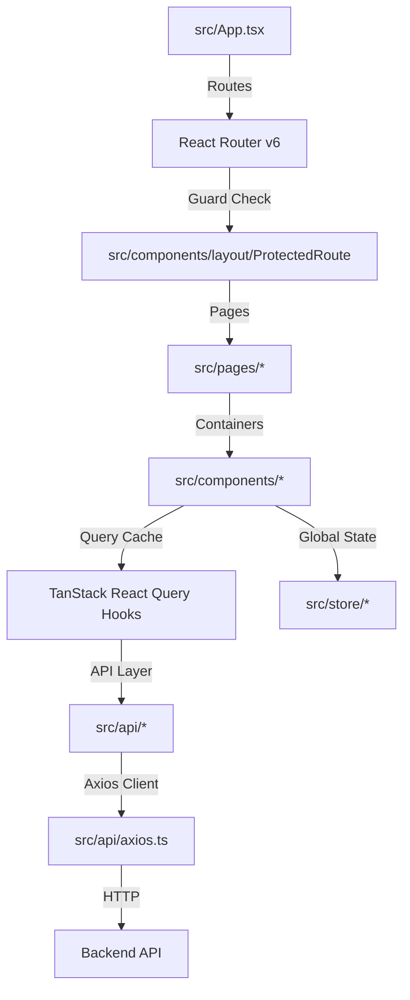

# Frontend Architecture & Codebase Explanation

This document provides a comprehensive walkthrough of the frontend codebase for the Chatbot Platform, built on **React 18**, **TypeScript**, **Vite**, **Zustand**, **TanStack React Query**, **Axios**, and **Tailwind CSS**.

---

## 1. Technical Stack Overview

The frontend is a single-page application (SPA) focused on clean state separation, type safety (zero `any`), and premium user experience (dark mode, transitions, micro-animations).



### Core Technologies
*   **React 18 & Vite**: Hot-module-reloaded layout render speeds with typescript bundling.
*   **TypeScript**: Structurally enforced data types with zero custom `any` interfaces.
*   **Zustand**: Lightweight global store management for tracking authentication credentials and visual states.
*   **TanStack Query v5 (React Query)**: Manage asynchronous server requests, automatic refetches, and optimistic cache invalidation.
*   **Axios**: Standard client for API calls, featuring automated JWT token refresh token interceptors.
*   **Tailwind CSS**: Modern CSS variables configuration, styling variables, and layout utility tokens.

---

## 2. Directory Structure

Below is the layout of the `frontend/` directory:

```text
frontend/
├── public/                 # Static asset definitions
├── src/
│   ├── api/                # Axios configuration and backend endpoint services
│   │   ├── axios.ts        # Automated token refresh handler client
│   │   └── *.api.ts        # Typed HTTP request definitions
│   ├── components/         # Reusable layouts, overlays, and features
│   │   ├── auth/           # Login and registration forms
│   │   ├── chat/           # Streaming chat view and input boxes
│   │   ├── files/          # Drag-and-drop document upload elements
│   │   ├── layout/         # Sidebar, navbar, and route access wrappers
│   │   ├── projects/       # Workspaces management cards and modals
│   │   └── ui/             # Core visual elements (Button, Modal, Input)
│   ├── hooks/              # custom TanStack hooks wrapping API layers
│   │   ├── useAuth.ts      # Authentication actions query integrations
│   │   ├── useChat.ts      # SSE client stream handler hook
│   │   └── useProject.ts   # Workspace configurations integrations hook
│   ├── pages/              # Routing page views
│   ├── store/              # Persisted Zustand state managers
│   │   ├── authStore.ts    # Authentication memory store
│   │   └── uiStore.ts      # Application modals visual state controller
│   ├── utils/              # Utility helpers
│   ├── App.tsx             # Application wrapper, queries context, and routing paths
│   └── main.tsx            # SPA root entry point
├── package.json            # Node scripts and dev dependencies configuration
├── tsconfig.json           # Type definitions compiler specifications
├── tailwind.config.ts      # Color palettes and dark mode parameters
└── vite.config.ts          # Vite asset pipelines configs
```

---

## 3. Core Module Architectures

### 3.1. Automated Request Refresh Interceptor
*   **[src/api/axios.ts](file:///Users/newuser/Documents/2026-projects/chatbot-platform/frontend/src/api/axios.ts)**:
    Implements a custom Axios instance equipped with interceptors:
    *   **Request Interceptor**: Reads the active `accessToken` from the Zustand `authStore` and injects it as a `Bearer` header.
    *   **Response Interceptor**: Intercepts `401 Unauthorized` errors. If an access token expires, it pauses all subsequent requests, triggers the token rotation endpoint `/api/v1/auth/refresh` (which reads the HttpOnly cookie), updates the local `accessToken`, and replays the paused request queue.

### 3.2. Global Store Controllers (Zustand)
*   **[src/store/authStore.ts](file:///Users/newuser/Documents/2026-projects/chatbot-platform/frontend/src/store/authStore.ts)**:
    Persists the application's authenticated state in `localStorage` (current user details and login status). Access tokens are cached in memory for safety.
*   **[src/store/uiStore.ts](file:///Users/newuser/Documents/2026-projects/chatbot-platform/frontend/src/store/uiStore.ts)**:
    Manages active project visual selections and visibility toggles for creation, editing, and deleting workspace modals.

### 3.3. React Query Custom Hooks
*   **[src/hooks/useAuth.ts](file:///Users/newuser/Documents/2026-projects/chatbot-platform/frontend/src/hooks/useAuth.ts)**:
    Wraps credentials requests inside `useMutation` hooks. Cleans state states and query caches during logout events.
*   **[src/hooks/useProject.ts](file:///Users/newuser/Documents/2026-projects/chatbot-platform/frontend/src/hooks/useProject.ts)**:
    Maps CRUD endpoints (get, create, update, delete) to queries, automatically invalidating stale caches on update events (`queryClient.invalidateQueries`).
*   **[src/hooks/useChat.ts](file:///Users/newuser/Documents/2026-projects/chatbot-platform/frontend/src/hooks/useChat.ts)**:
    Orchestrates the Server-Sent Events (SSE) consumption logic.
    *   Sends a POST request with the workspace context.
    *   Reads the streamed binary reader loop, splitting lines dynamically.
    *   Parses incoming events: updates tokens real-time, displays validation errors, and handles the `[DONE]` termination flag.

### 3.4. Components & View Structures
*   **[src/components/layout/ProtectedRoute.tsx](file:///Users/newuser/Documents/2026-projects/chatbot-platform/frontend/src/components/layout/ProtectedRoute.tsx)**:
    Blocks layout routes if a user is not authenticated, redirecting them to `/login`.
*   **[src/components/chat/](file:///Users/newuser/Documents/2026-projects/chatbot-platform/frontend/src/components/chat/)**:
    *   `ChatWindow`: Displays conversations list. Features a hook that auto-scrolls the window to the bottom when new message tokens stream in.
    *   `ChatInput`: Rich textarea supporting keyboard shortcuts (Submit on Enter, newline on Shift+Enter).
    *   `TypingIndicator`: Animated bouncing dots representing LLM processing states.
*   **[src/components/files/](file:///Users/newuser/Documents/2026-projects/chatbot-platform/frontend/src/components/files/)**:
    *   `FileUploader`: Drag-and-drop workspace uploader with transition states. Checks file formats and restricts files > 20MB directly in-browser.
    *   `FileList`: Tabulates active workspace attachments showing names, formatted sizes, and deletion controls.

---

## 4. Visual Styles & Layout Rules

1.  **Tailwind Theme**:
    The application features a sleek dark-themed design system using deep grays, rich charcoal surfaces, emerald active accents, and glassmorphism borders.
2.  **Responsive Design**:
    Employs flexboxes, grids, and hidden-sidebar layouts to ensure the dashboard works across screen sizes (mobile, tablet, and widescreen monitors).
3.  **UI Feedback Indicators**:
    Micro-transitions are integrated across all interactive components (buttons, links, files drag overlays, and typing icons) to provide clear feedback to the user.
